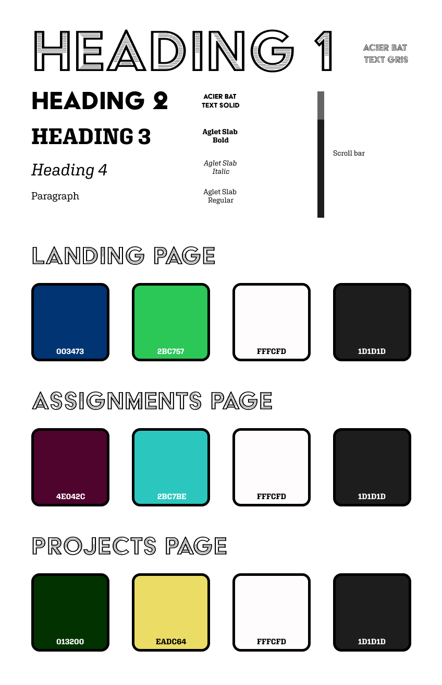
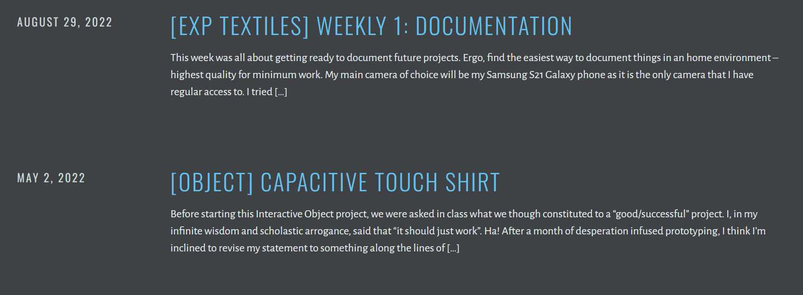
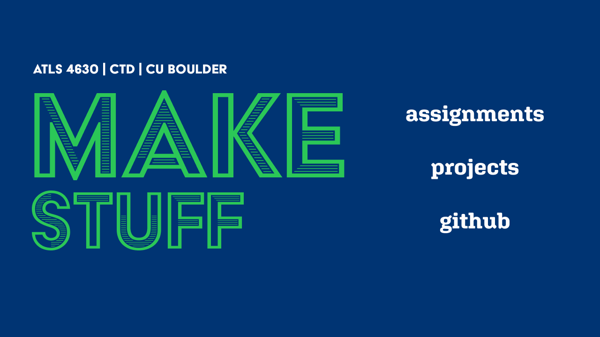
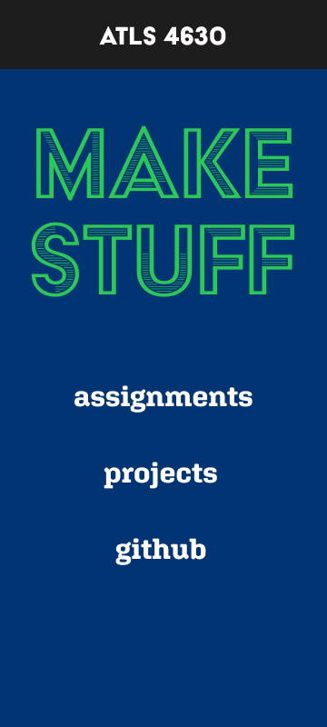
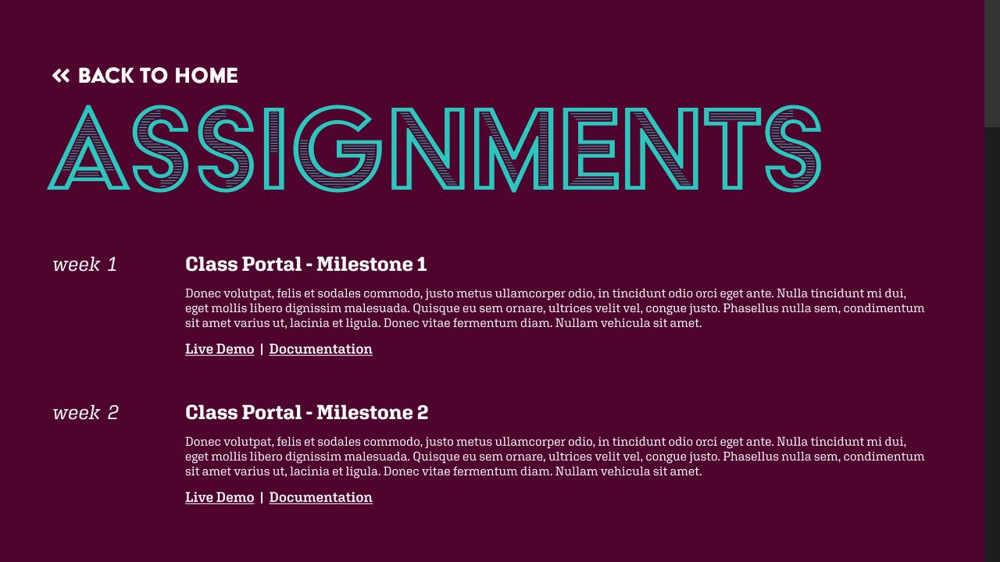
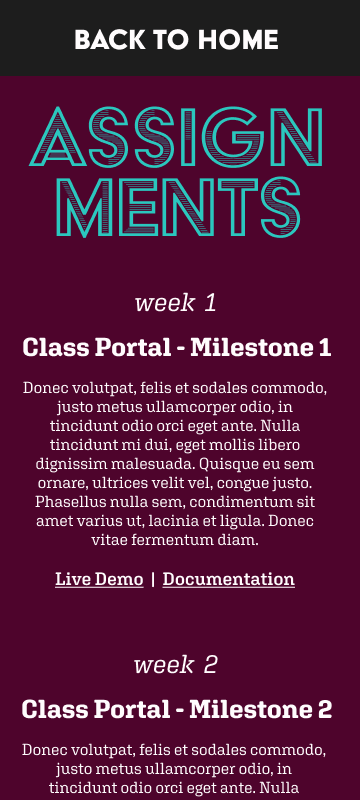
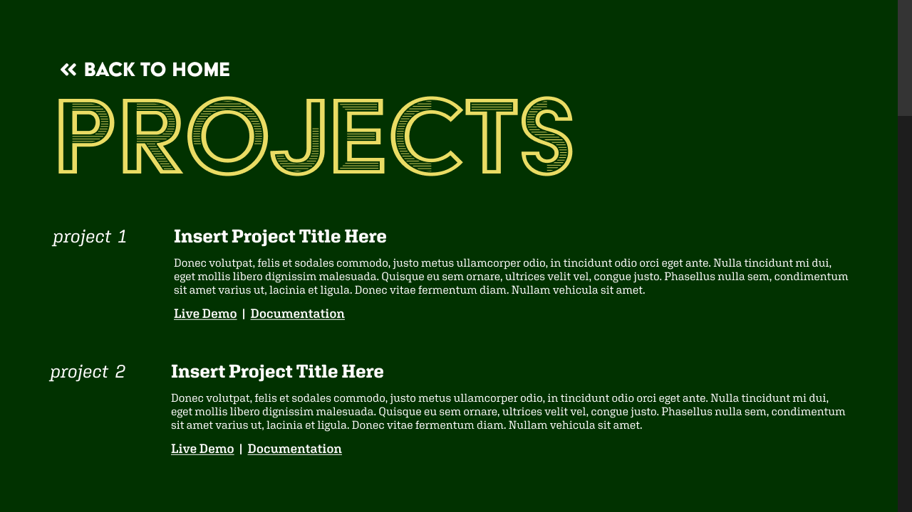
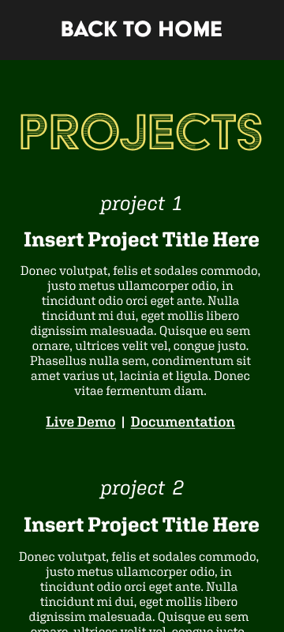

# Class Portal, Milestone 1

## Assignment Goal

Design and develop a class portal that will consolidate all class assignments, projects, and documentation in one place. The portal should be a good representation of my current  design and web development skills in vanilla HTML, CSS, and JS.

### Milestone 1

- [x] Brainstorm ways to layout the information for the various assignments and projects
- [x] Choose a color palette
- [x] Design a header
- [x] Create some high fidelity wireframes in Figma

## [LINK TO PART 2](../week2/week2.md)

---

## Font and Color

To begin creating the general layout and design of my site, I had to figure out what I wanted this site to feel like - the general "vibes" of the project, if you will.

I trend towards using a lot of bold colors and typography when designing landing pages with a focus and being kind of fun and exciting. This means that a lot of my design process starts with choice of font and color palette.

<!--  -->

    

The style I ended up going with is something a little funky, a little wierd, and definitely not to everybody's taste. My header font can best be described as "art deco adjacent" while my subheader and paragraph font is a slab serif font. Clean, but a little typewriter-y and square.

As for the colors, I demo'd several pairings and landed on three that should not cause serious eye strain and hopefully provide enough visual contrast for easy legibility.

## Layout

I went out to find inspiration through an examination of my current WordPress documentation site. It uses a basic WordPress.com theme called "Escutcheon" that I chose because I liked the clean blog page layout. Since there's no use in reinventing the wheel, I simply remixed this text layout for my own use.

## Wireframes

After all that prep work, putting everything together in Figma was fairly straightforward. For headers, I followed Danny Rankin's advice (patent pending) to make things that are important on a page really, really big. I also intend to put some fun hover effects on links and a fade in transition on the Assignments page when I have enough entries to warrant scrolling on the page.

Other than that, I'll let the work speak for itself.

### Landing Page

<!--  -->

<!--  -->

    

### Assignments Page

<!--  -->

    

### Projects Page

<!--  -->

    

